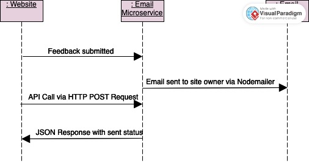

# Email Feedback Service

This service allows users to send feedback via email to the website owner

### `POST /emailServer`

To have an email sent with user feedback, include the following information in a post request. The actual url will be provided to authorized users.

Request body:

```json
{
  "websiteOwnerEmail": "siteOwnerEmail@email.com",
  "userEmail": "userEmail@email.com",
  "feedback": "You are great!",
  "feedbackRating": 5.0,
  "requestResponse": true
}
```

Response body:

```json
{
  "message": "Email sent successfully!",
  "emailData": {
    "websiteOwnerEmail": "siteOwnerEmail@email.com",
    "userEmail": "userEmail@email.com",
    "feedback": "you are great",
    "feedbackRating": 5,
    "requestResponse": true
  }
}
```

Example call using axios:

```
const axios = require('axios');

const postData = {
    websiteOwnerEmail: "siteOwnerEmail@email.com",
    userEmail: "userEmail@email.com",
    feedback: "You are great!",
    feedbackRating: 5.0,
    requestResponse: true
};

axios.post('http://localhost:3005/emailServer', postData)
    .then(response => {
        console.log('Response:', response.data);
    })
    .catch(error => {
        console.error('Error:', error);
    });
```
### UML Diagram of API

